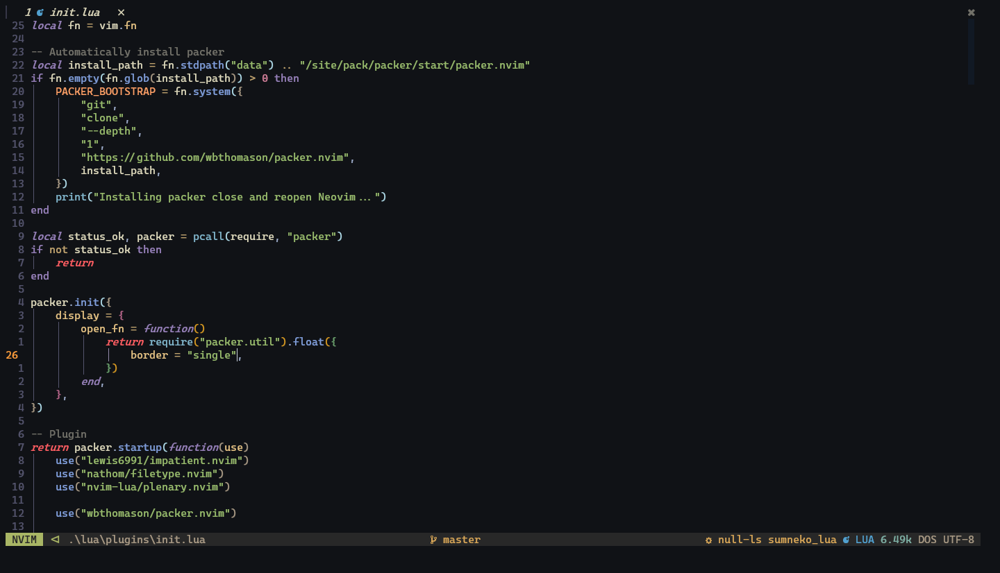
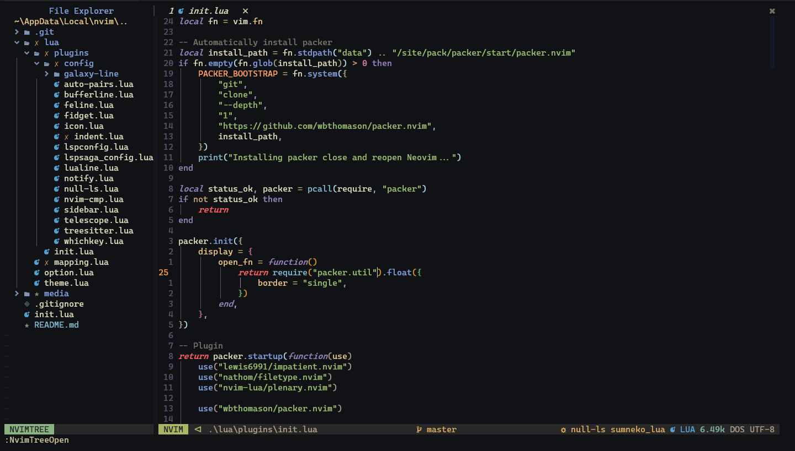
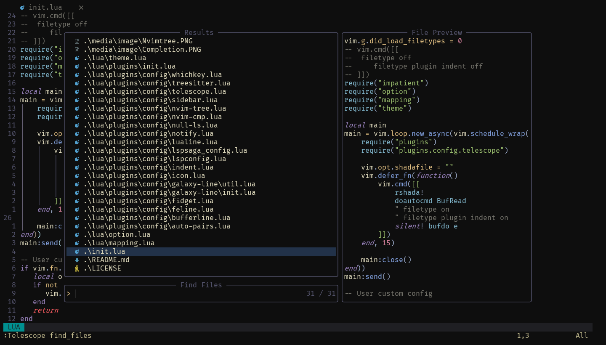

#

## Features

- LSP code completion


- [Treesitter](https://github.com/nvim-treesitter/nvim-treesitter) based code highlighting


- [NvimTree](https://github.com/kyazdani42/nvim-tree.lua) as file tree


- 🔭 [Fuzzy finder](https://github.com/nvim-telescope/telescope.nvim)


- [Sidebar](https://github.com/sidebar-nvim/sidebar.nvim)


- [Whichkey](https://github.com/folke/which-key.nvim)


## Requirements

- [Nerd Fonts](https://www.nerdfonts.com/font-downloads)
- [Neovim 0.6+](https://github.com/neovim/neovim/releases/tag/v0.6.1)
- [Node.js](https://nodejs.org)
- [Lua language server](https://github.com/sumneko/lua-language-server)

## Optional

- [Ripgrep](https://github.com/BurntSushi/ripgrep)
- [fd](https://github.com/sharkdp/fd)
- [Language server protocol](https://github.com/neovim/nvim-lspconfig/blob/master/doc/server_configurations.md)

## Installation

***Please backup any existing configuration files***

### Clone the repository

#### Linux

```text
git clone https://github.com/AkagiYuu/neovim-config ~/.config/nvim
nvim +PackerSync
```

#### Windows

```text
git clone https://github.com/AkagiYuu/neovim-config ~/AppData/Local/nvim
nvim +PackerSync
```

## Plugins (48)

- [Packer](https://github.com/wbthomason/packer.nvim)
- [Impatient](https://github.com/lewis6991/impatient.nvim)
- [Plenary](https://github.com/nvim-lua/plenary.nvim)
- [Filetype](https://github.com/nathom/filetype.nvim)
- [Feline](https://github.com/feline-nvim/feline.nvim)
- [Bufferline](https://github.com/akinsho/bufferline.nvim)
- [Treesitter](https://github.com/nvim-treesitter/nvim-treesitter)
  - [ts-rainbow](https://github.com/p00f/nvim-ts-rainbow)
  - [ts-autotag](https://github.com/windwp/nvim-ts-autotag)
- [Nvimtree](https://github.com/kyazdani42/nvim-tree.lua)
- [Telescope](https://github.com/nvim-telescope/telescope.nvim)
  - [Fzf](https://github.com/nvim-telescope/telescope-fzf-native.nvim)
  - [File browser](https://github.com/nvim-telescope/telescope-file-browser.nvim)
- [Sidebar](https://github.com/sidebar-nvim/sidebar.nvim)
- Language server protocol
  - [Lspconfig](https://github.com/neovim/nvim-lspconfig)
  - [Cmp-lsp](https://github.com/hrsh7th/cmp-nvim-lsp)
  - [Null-ls](https://github.com/jose-elias-alvarez/null-ls.nvim)
  - [Fidget](https://github.com/j-hui/fidget.nvim)
  - [Lspsaga](https://github.com/tami5/lspsaga.nvim)
- Completion
  - [Cmp](https://github.com/hrsh7th/nvim-cmp)
  - [Luasnip](https://github.com/L3MON4D3/LuaSnip)
  - [Cmp-luasnip](https://github.com/saadparwaiz1/cmp_luasnip)
  - [Friendly snippets](https://github.com/rafamadriz/friendly-snippets)
  - [Cmdline](https://github.com/hrsh7th/cmp-cmdline)
  - [Buffer](https://github.com/hrsh7th/cmp-buffer)
  - [Path](https://github.com/hrsh7th/cmp-path)
  - [Copilot](https://github.com/github/copilot.vim)
- [Comment](https://github.com/numToStr/Comment.nvim)
- [Todo comment](https://github.com/folke/todo-comments.nvim)
- [Auto pair](https://github.com/windwp/nvim-autopairs)
- [Terminal](https://github.com/akinsho/toggleterm.nvim)
- [Trouble](https://github.com/folke/trouble.nvim)
- [Lightspeed](https://github.com/ggandor/lightspeed.nvim)
- [Indent blankline](https://github.com/lukas-reineke/indent-blankline.nvim)
- [Cursorline](https://github.com/yamatsum/nvim-cursorline)
- [Scrollview](https://github.com/dstein64/nvim-scrollview)
- [Colorizer](https://github.com/norcalli/nvim-colorizer.lua)
- [Zenmode](https://github.com/folke/zen-mode.nvim)
  - [Twilight](https://github.com/folke/twilight.nvim)
- [Git signs](https://github.com/lewis6991/gitsigns.nvim)
- [Hlslens](https://github.com/kevinhwang91/nvim-hlslens)
- [Kanagawa](https://github.com/rebelot/kanagawa.nvim)
- Icon
  - [nvim-web-devicons](https://github.com/kyazdani42/nvim-web-devicons)
  - [Lspkind](https://github.com/onsails/lspkind-nvim)
- [Notify](https://github.com/rcarriga/nvim-notify)
- [Whichkey](https://github.com/folke/which-key.nvim)
- [Startup time](https://github.com/dstein64/vim-startuptime)
